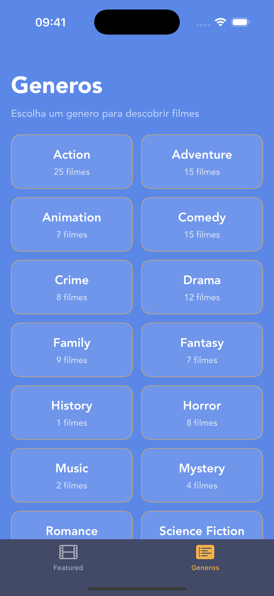
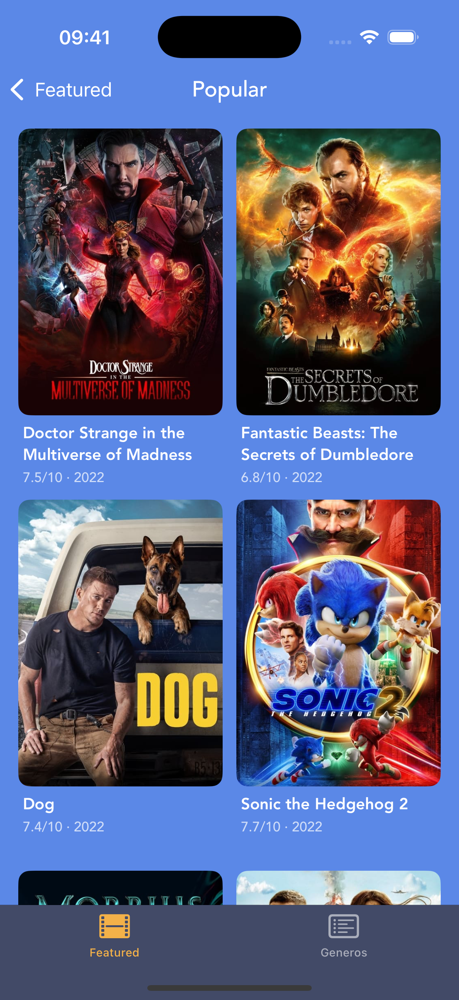

<div align="center">

# Encontre Aqui

### Catalogo de filmes iOS com secoes de destaque, navegacao por genero e detalhes completos -- construido com Swift, UIKit e UICollectionView

[](https://swift.org)
[](https://developer.apple.com/documentation/uikit)
[](https://developer.apple.com/xcode/)

</div>

---

## Sobre o Projeto

**Encontre Aqui** e um catalogo de filmes para iOS com mais de 100 titulos organizados em secoes -- Popular, Now Playing e Upcoming. O usuario pode navegar por genero, explorar todos os filmes de uma categoria e visualizar detalhes completos com poster, sinopse, avaliacao e generos.

> Encontre aqui o filme pra sua proxima sessao de cinema!

---

## Screenshots

<div align="center">

| Catalogo | Generos | Ver Todos |
|:---:|:---:|:---:|
|  |  |  |

</div>

---

## Funcionalidades

- **3 secoes de filmes** -- Popular, Now Playing e Upcoming com scroll horizontal
- **Navegacao por genero** -- tab dedicada com cards por genero e contagem de filmes
- **See All** -- grid completo de filmes ao tocar "See all" em qualquer secao
- **Tela de detalhes** -- backdrop, poster, rating, generos, data e sinopse
- **+100 filmes catalogados** -- com poster, backdrop e informacoes completas
- **Tab bar intuitiva** -- Featured e Generos com icones visiveis e feedback visual

---

## Tecnologias

- **Swift** -- linguagem principal do desenvolvimento
- **UIKit** -- interface com Storyboard e ViewCode combinados
- **UICollectionView** -- collection views horizontais e grids programaticos
- **Auto Layout** -- constraints para layout responsivo
- **MVC** -- arquitetura com extensoes para DataSource e Delegate
- **UITabBarController** -- navegacao entre secoes com tab bar customizada
- **UINavigationController** -- hierarquia de navegacao com large titles

---

## Arquitetura

```
Encontre_Aqui/
├── Model/
│   ├── Movie.swift                              ← struct principal
│   ├── Movie+Popular.swift                      ← 20 filmes populares
│   ├── Movie+NowPlaying.swift                   ← 20 filmes em cartaz
│   ├── Movie+Upcoming.swift                     ← 20 filmes em breve
│   ├── Movie+TrendingThisWeek.swift             ← 20 filmes trending semana
│   └── Movie+TrendingToday.swift                ← 20 filmes trending hoje
├── Controllers/
│   ├── FeaturedViewController.swift             ← tela principal
│   ├── FeaturedViewController+DataSource.swift  ← populacao das cells
│   ├── FeaturedViewController+Delegate.swift    ← selecao e navegacao
│   ├── DetailsViewController.swift              ← tela de detalhes
│   ├── SeeAllViewController.swift               ← grid de todos os filmes
│   └── GenresViewController.swift               ← navegacao por genero
├── View/
│   ├── PopularCollectionViewCell.swift           ← cell backdrop grande
│   ├── NowplayingCollectionViewCell.swift        ← cell poster + ano
│   ├── UpcomingCollectionViewCell.swift           ← cell poster + ano
│   ├── SeeAllCell.swift                          ← cell do grid See All
│   ├── GenreCell.swift                           ← card de genero
│   └── Base.lproj/Main.storyboard               ← layout principal
└── Assets.xcassets/                              ← 100+ posters e backdrops
```

---

## Como Executar

1. Clone o repositorio
   ```bash
   git clone https://github.com/GeozedequeGuimaraes/EncontreAqui.git
   ```
2. Abra o arquivo `Encontre_Aqui.xcodeproj` no Xcode
3. Selecione um simulador ou dispositivo fisico (iOS 15.5+)
4. Execute o projeto com `Cmd + R`

---

## Autor

<div align="center">

**Geozedeque Guimaraes**

Estudante de Ciencia da Computacao -- CIn-UFPE

[](https://github.com/GeozedequeGuimaraes)
[](https://linkedin.com/in/geozedeque-guimaraes)

</div>
