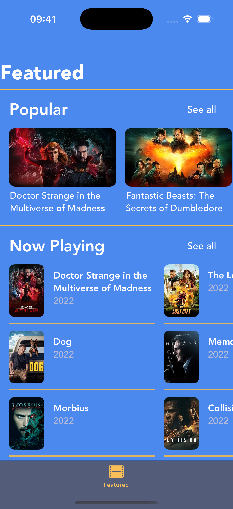

<div align="center">

# Encontre Aqui

### Catalogo de filmes iOS com secoes de destaque, detalhes completos e design imersivo -- construido com Swift, UIKit e UICollectionView

[](https://swift.org)
[](https://developer.apple.com/documentation/uikit)
[](https://developer.apple.com/xcode/)

</div>

---

## Sobre o Projeto

**Encontre Aqui** e um catalogo de filmes para iOS com mais de 100 titulos organizados em secoes -- Popular, Now Playing e Upcoming. Cada filme possui poster, backdrop, sinopse, generos, data de lancamento e nota de avaliacao. A interface e construida com UICollectionView em scroll horizontal para cada secao e uma tela de detalhes completa ao tocar em qualquer filme.

> Encontre aqui o filme pra sua proxima sessao de cinema!

---

## Screenshots

<div align="center">

| Catalogo | Detalhes |
|:---:|:---:|
|  |  |

</div>

---

## Funcionalidades

- **3 secoes de filmes** -- Popular, Now Playing e Upcoming com scroll horizontal independente
- **+100 filmes catalogados** -- com poster, backdrop, sinopse e avaliacao
- **Tela de detalhes** -- backdrop, poster, rating, generos, data de lancamento e sinopse completa
- **Navegacao por segue** -- transicao fluida entre catalogo e detalhes
- **Design imersivo** -- interface com fundo azul e cards arredondados
- **Layout responsivo** -- Auto Layout com UICollectionView adaptavel a diferentes telas

---

## Tecnologias

- **Swift** -- linguagem principal do desenvolvimento
- **UIKit** -- construcao de toda a interface com Storyboard e ViewCode
- **UICollectionView** -- tres collection views horizontais independentes para cada secao
- **Auto Layout** -- constraints para layout responsivo em diferentes dispositivos
- **MVC** -- arquitetura Model-View-Controller com extensoes para DataSource e Delegate
- **Segues** -- navegacao entre telas via Storyboard

---

## Arquitetura

O projeto segue o padrao **MVC** com extensoes separadas para DataSource e Delegate.

```
Encontre_Aqui/
├── Model/
│   ├── Movie.swift                              ← struct principal
│   ├── Movie+Popular.swift                      ← 20 filmes populares
│   ├── Movie+NowPlaying.swift                   ← 20 filmes em cartaz
│   ├── Movie+Upcoming.swift                     ← 20 filmes em breve
│   ├── Movie+TrendingThisWeek.swift             ← 20 filmes trending semana
│   └── Movie+TrendingToday.swift                ← 20 filmes trending hoje
├── Controllers/
│   ├── FeaturedViewController.swift             ← tela principal
│   ├── FeaturedViewController+DataSource.swift  ← populacao das cells
│   ├── FeaturedViewController+Delegate.swift    ← selecao e navegacao
│   └── DetailsViewController.swift              ← tela de detalhes
├── View/
│   ├── PopularCollectionViewCell.swift           ← cell backdrop grande
│   ├── NowplayingCollectionViewCell.swift        ← cell poster + ano
│   ├── UpcomingCollectionViewCell.swift           ← cell poster + ano
│   └── Base.lproj/
│       └── Main.storyboard                       ← layout principal
└── Assets.xcassets/                              ← 100+ posters e backdrops
```

---

## Como Executar

1. Clone o repositorio
   ```bash
   git clone https://github.com/GeozedequeGuimaraes/EncontreAqui.git
   ```
2. Abra o arquivo `Encontre_Aqui.xcodeproj` no Xcode
3. Selecione um simulador ou dispositivo fisico (iOS 15.5+)
4. Execute o projeto com `Cmd + R`

---

## Autor

<div align="center">

**Geozedeque Guimaraes**

Estudante de Ciencia da Computacao -- CIn-UFPE

[](https://github.com/GeozedequeGuimaraes)
[](https://linkedin.com/in/geozedeque-guimaraes)

</div>
