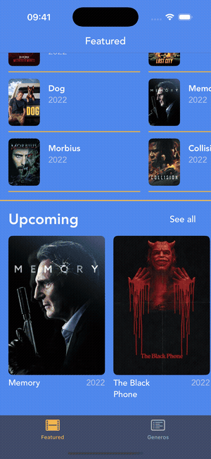
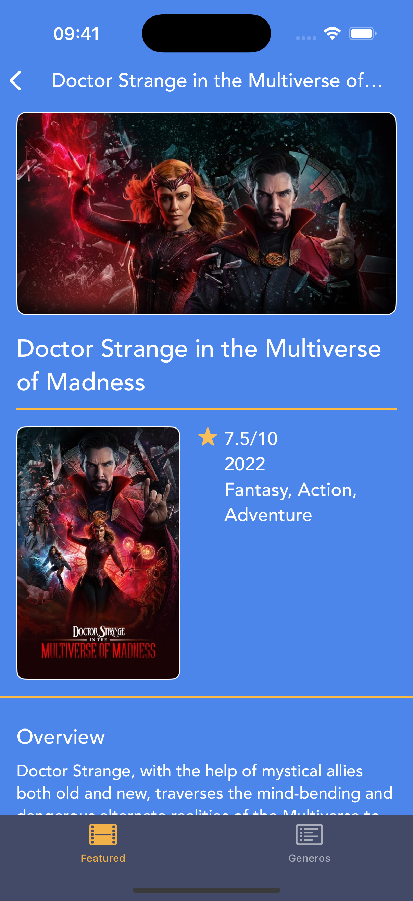

<div align="center">

# Encontre Aqui

Catalogo de filmes iOS com secoes de destaque, navegacao por genero e detalhes completos — Swift, UIKit, UICollectionView

[](https://swift.org)
[](https://developer.apple.com/documentation/uikit)
[](https://developer.apple.com/xcode/)

</div>

---

## Sobre o projeto

Encontre Aqui e um catalogo de filmes para iOS com mais de 100 titulos em tres secoes: Popular, Now Playing e Upcoming. O usuario navega por genero, explora todos os filmes de uma categoria e visualiza detalhes completos com poster, sinopse, avaliacao e generos.

---

## Demo

<div align="center">

</div>

---

## Funcionalidades

- Tres secoes de filmes (Popular, Now Playing, Upcoming) com scroll horizontal
- Navegacao por genero com tab dedicada, cards por genero e contagem de filmes
- Grid completo ao tocar "See all" em qualquer secao
- Tela de detalhes com backdrop, poster, rating, generos, data e sinopse
- Mais de 100 filmes catalogados com poster e backdrop
- Tab bar com as abas Featured e Generos

---

## Tecnologias

- Swift
- UIKit com Storyboard e ViewCode combinados
- UICollectionView com scroll horizontal e grids programaticos
- Auto Layout
- MVC com extensoes para DataSource e Delegate
- UITabBarController e UINavigationController com large titles

---

## Arquitetura

```
Encontre_Aqui/
├── Model/
│   ├── Movie.swift
│   ├── Movie+Popular.swift
│   ├── Movie+NowPlaying.swift
│   ├── Movie+Upcoming.swift
│   ├── Movie+TrendingThisWeek.swift
│   └── Movie+TrendingToday.swift
├── Controllers/
│   ├── FeaturedViewController.swift
│   ├── FeaturedViewController+DataSource.swift
│   ├── FeaturedViewController+Delegate.swift
│   ├── DetailsViewController.swift
│   ├── SeeAllViewController.swift
│   └── GenresViewController.swift
├── View/
│   ├── PopularCollectionViewCell.swift
│   ├── NowplayingCollectionViewCell.swift
│   ├── UpcomingCollectionViewCell.swift
│   ├── SeeAllCell.swift
│   ├── GenreCell.swift
│   └── Base.lproj/Main.storyboard
└── Assets.xcassets/
```

---

## Como executar

1. Clone o repositorio:

```bash
git clone https://github.com/GeozedequeGuimaraes/EncontreAqui.git
```

2. Abra `Encontre_Aqui.xcodeproj` no Xcode
3. Selecione um simulador ou dispositivo fisico (iOS 15.5+)
4. Execute com `Cmd + R`

---

## Screenshots

<div align="center">

| Catalogo | Ver todos | Detalhes | Generos |
|:---:|:---:|:---:|:---:|
|  |  |  |  |

</div>

---

## Autor

<div align="center">

Geozedeque Guimaraes — Estudante de Ciencia da Computacao, CIn-UFPE

[](https://github.com/GeozedequeGuimaraes)
[](https://linkedin.com/in/geozedeque-guimaraes)

</div>
